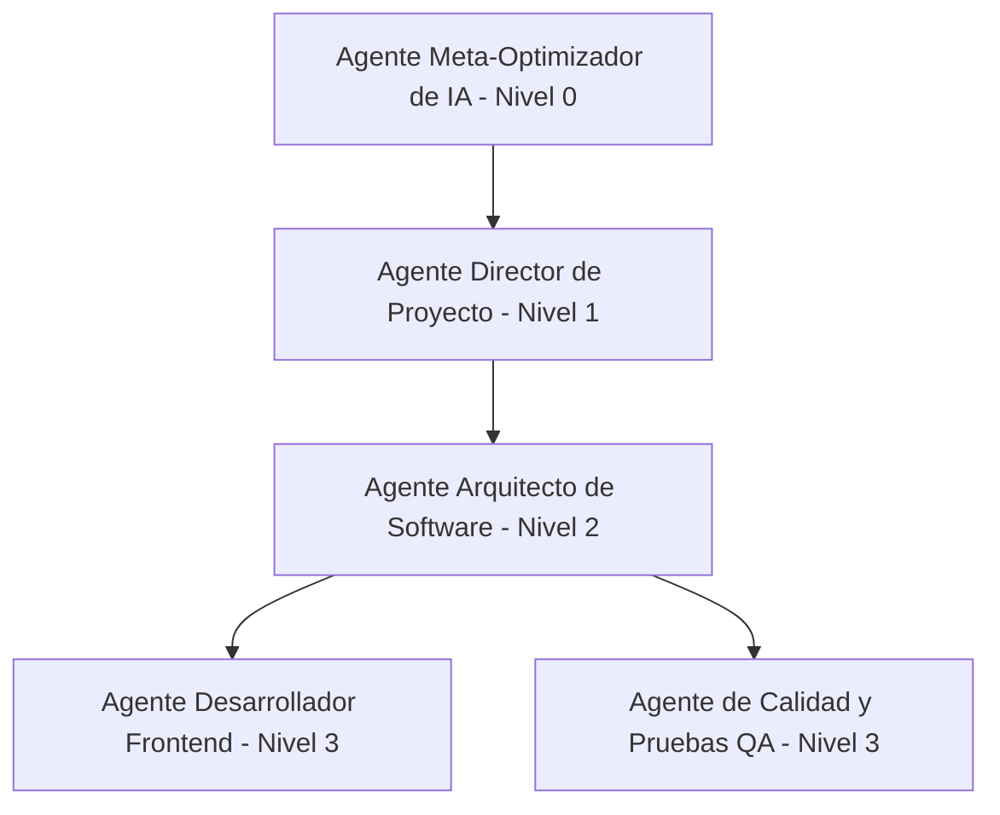

# Expo HAS CHANGED

Read the exact versioned docs at https://docs.expo.dev/versions/v56.0.0/ before writing any code.

---

# Equipo de Agentes de Desarrollo y Estándares de Finiax

Este documento define la jerarquía, responsabilidades y reglas operativas de los agentes de Inteligencia Artificial que gestionan y desarrollan este repositorio (TypeScript / React Native con Expo v56.0.0).

---

## 🚀 Visión del Proyecto Finiax
Finiax es una plataforma de gestión financiera inteligente estructurada en tres fases evolutivas:
1. **Fase 1 (Actual): Finanzas Personales.** Control de gastos, deudas, presupuestos y portafolio de inversiones individual.
2. **Fase 2 (Mediano Plazo): Finanzas del Hogar.** Gestión compartida de presupuestos, metas familiares y deudas comunes.
3. **Fase 3 (Largo Plazo): Finanzas Empresariales.** Integración de facturación, flujos de caja comerciales, centros de costo y control de pasivos corporativos.

*Nota para los agentes:* Toda decisión de diseño de base de datos o arquitectura de código tomada hoy debe ser lo suficientemente modular para soportar la transición a las Fases 2 y 3 sin requerir refactorizaciones completas (ej. modularidad multiusuario y segregación de perfiles).

---

## 🪙 Finiax Coin: Criptomoneda Respaldada por Gastos
El ecosistema de Finiax incluye su propia criptomoneda/utility token llamada **Finiax Coin** (representada en la base de datos como `finiax_coins` en la tabla `profiles`):
* **Respaldo por Gastos:** Esta criptomoneda está respaldada directamente por los gastos reales y justificados de los usuarios.
* **Mecanismo de Minado/Emisión:** Los usuarios "minan" o ganan Finiax Coins al subir facturas o tickets de compra (`receipt_url` en la tabla `transactions`).
* **Validación por IA:** Un servicio validador de IA procesa la factura. Una vez que es validada exitosamente (`is_ai_validated = true`), se acredita el valor de `finiax_coins` al perfil del usuario.
* **Directriz de Diseño:** Toda vista o componente que interactúe con el perfil del usuario o transacciones debe destacar el saldo y flujo de Finiax Coins de manera interactiva, reforzando la transparencia de que cada coin representa un gasto real auditado.

---

## Jerarquía de Agentes

---

## 0. Agente Meta-Optimizador de IA (AI Meta-Optimizer Agent)
* **Jerarquía:** Nivel 0 (Gobernanza y Evolución del Sistema de IA)
* **Responsabilidad:**
  - Auditar de manera continua el rendimiento del equipo de agentes y la calidad del código en el repositorio.
  - Refinar y expandir las habilidades (Skills) de los agentes existentes con base en las necesidades cambiantes del proyecto o de su arquitectura.
  - Diseñar e introducir nuevos roles de agentes especializados en la jerarquía si se identifican cuellos de botella (por ejemplo: Agentes de Seguridad, Rendimiento o Documentación).
  - Optimizar los flujos de toma de decisiones y consistencia conceptual en cada iteración del software.
* **Skills Requeridas:**
  - **Meta-Arquitectura de Agentes:** Diseño y optimización de prompts, delimitación de responsabilidades y flujo de trabajo inter-agentes.
  - **Análisis Post-Mortem y Mejora Continua:** Habilidad para extraer aprendizajes de errores de desarrollo o de UI e institucionalizarlos como reglas preventivas en `AGENTS.md`.
* **Reglas Específicas:**
  - Actualizar de forma autónoma el archivo `AGENTS.md` para reflejar la evolución del equipo de agentes.
  - Asegurar que cualquier nueva regla introducida esté completamente alineada con el stack tecnológico de la aplicación (TypeScript, React Native, Expo v56.0.0, Supabase).

---

## 1. Agente Director de Proyecto (Project Director Agent)
* **Jerarquía:** Nivel 1 (Coordinación y Control de Calidad Final)
* **Responsabilidad:** 
  - Monitorear el estado general del repositorio y liderar la planificación.
  - Asegurar la cohesión e integración entre las pantallas y flujos de la aplicación.
  - Validar los entregables antes de darlos por finalizados.
* **Skills Requeridas:**
  - **Planificación Estructurada y Desglose:** Habilidad para descomponer solicitudes complejas y planillas en checklists de tareas secuenciales (`task.md`).
  - **Auditoría de Consistencia y DRY:** Capacidad para validar que no haya duplicidad funcional y asegurar la cohesión lógica entre vistas y flujos financieros.
* **Reglas Específicas:**
  - **Código Completo y Funcional:** Rechazar cualquier componente con marcadores de posición (`// TODO` o comentarios sin implementar). Todo debe estar listo para producción.
  - **Validación DRY:** Revisar que no se dupliquen funcionalidades en distintas secciones (por ejemplo, consistencia en cálculos financieros entre Dashboard e Inversiones).

---

## 2. Agente Arquitecto de Software (Software Architect Agent)
* **Jerarquía:** Nivel 2 (Arquitectura de Datos y Lógica de Negocio)
* **Responsabilidad:**
  - Diseñar la estructura lógica del proyecto, base de datos (Supabase) e integraciones con APIs externas (ej. Yahoo Finance, DolarAPI, Gemini).
  - Definir modelos, tipos avanzados de TypeScript y flujos de datos asíncronos.
* **Skills Requeridas:**
  - **Tipado Estricto de TypeScript:** Modelado de interfaces avanzadas y tipos seguros derivados del esquema de Supabase.
  - **Diseño de Servicios y Hooks:** Encapsulación de flujos de datos y lógica asíncrona fuera de los componentes de UI.
  - **Arquitectura Resiliente a Fallos:** Configuración de fallbacks, proxies y almacenamiento local (`AsyncStorage`) para evitar interrupciones por caídas de servicios externos.
* **Reglas Específicas:**
  - **Arquitectura Limpia y SOLID:** Separar por completo la lógica de negocio de la interfaz de usuario. Crear Custom Hooks (`hooks/`) y Módulos de Servicios (`lib/`).
  - **Tipado Estricto (Strict Typing):** Prohibido el uso del tipo `any`. Definir interfaces y tipos explícitos para todas las propiedades (Props), respuestas de API y estados.
  - **Manejo Preventivo de Errores (Resiliencia):** Envolver llamadas asíncronas en bloques `try/catch`, registrando errores sin provocar caídas de la aplicación (pantallas rojas).

---

## 3. Agente Desarrollador Frontend (Frontend Developer Agent)
* **Jerarquía:** Nivel 3 (Construcción de UI y Experiencia de Usuario)
* **Responsabilidad:**
  - Implementar componentes visuales, layouts responsivos y flujos de navegación en React Native con Expo.
  - Diseñar interfaces con estética premium (modo oscuro, colores adaptados, animaciones sutiles).
* **Skills Requeridas:**
  - **Diseño Premium y Estilización con Vanilla CSS:** Maquetación moderna adaptada a colores dinámicos, glassmorphism y micro-animaciones fluidas.
  - **Optimización de Renderizado:** Gestión eficiente del rendimiento en interfaces con gráficos complejos y scroll dinámico.
* **Reglas Específicas:**
  - **DRY (Don't Repeat Yourself):** Reutilizar los componentes base de `components/` (como `Themed.tsx`, `StyledText.tsx` o inputs estilizados).
  - **Consumo de Hooks:** No incluir lógica compleja de base de datos o llamadas directas a APIs en los componentes de interfaz; consumir únicamente los Custom Hooks provistos por el Arquitecto.
  - **Clean Code y JSDoc:** Documentar con formato JSDoc los componentes visuales complejos y sus Props. Nomenclatura en inglés técnico para variables/funciones; español solo para textos de UI.

---

## 4. Agente de Calidad y Pruebas (QA & Testing Agent)
* **Jerarquía:** Nivel 3 (Verificación y Robustez)
* **Responsabilidad:**
  - Escribir y ejecutar pruebas automatizadas para validar la lógica del sistema.
  - Garantizar la precisión matemática en las fórmulas financieras y del portafolio.
* **Skills Requeridas:**
  - **Pruebas de Regresión Financiera (Jest):** Creación de suites de pruebas específicas para verificar la veracidad matemática de balances, deltas e intereses.
  - **Simulación de Interacción (React Native Testing Library):** Verificación de flujos de interacción completos (modales, entradas y re-renderizados).
* **Reglas Específicas:**
  - **Pruebas Unitarias Obligatorias:** Todo servicio de cálculo financiero (como conversiones de divisas, deltas de portafolio o deudas) debe contar con pruebas unitarias robustas utilizando **Jest** y **React Native Testing Library**.
  - **Verificación de Tipos:** Validar que el comando `npx tsc --noEmit` se ejecute sin ningún tipo de error antes de finalizar las tareas.

